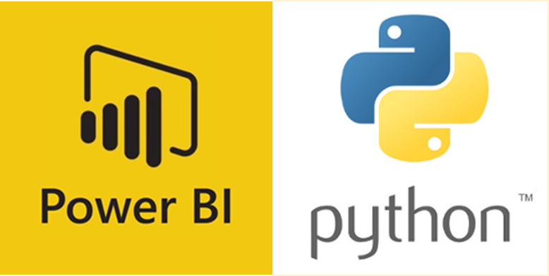

# 2. Python Integration Help

To do this, you will need to be familiar with:

- All content in the basic task
- Supervised learning with scikit-learn

## Rationale

This section shows how to implement Python into a Power BI workflow, so that whenever the data model is refreshed, the .py script is executed. 

## Context

This project uses supervised learning with sklearn to predict the target (survived) for a hold out set. A pipeline is used to process and fit the model. Predictions are made and a classification report is produced to help quantify model performance. The classification report is then converted to a dataframe.

## Things to note

* You will need to adjust the code to set your own working directory. This doesn't have to be where the .pbix file lives, but I would advise it. 
* You will need to have pandas, numpy and sci-kit learn installed.
* Power BI auto detects your python executable in order to create a connection with python. [Guidance for troubleshooting.](https://towardsdatascience.com/using-python-in-power-bi-ee95a6b71443)
* Power BI expects objects to be stored as DataFrames in order to import them. Other types of objects may be supported, too. But you are safe if coercing to a Pandas DF. Note, avoid complex data types which may not be supported.