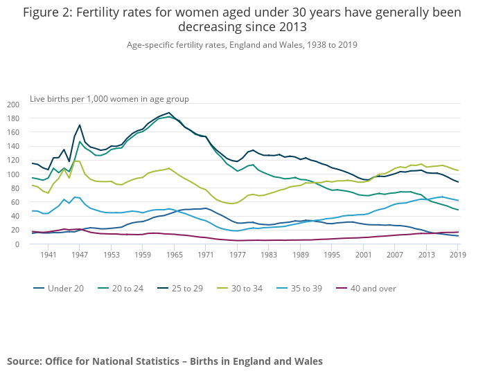
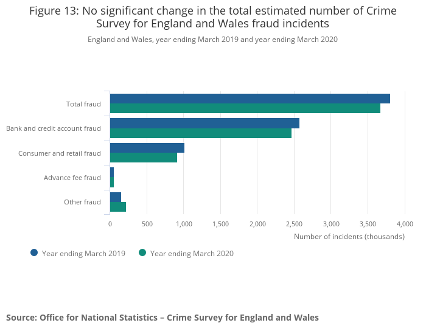

# Dataviz in R / Python Day 03 Plan
***

## Purpose
***

* Apply learning from courses to chosen context.
* Practise applying ONS style guide to visuals.
* Explore data feminism implications for data visualisation.
* Practise applying data feminism principles to above visualisation.
* Compare and contrast the two approaches.

## Activities
***

* Pair programming.
* Peer to peer presentations.
* Group feedback.

## Resources & Pre-reading
***

* It would be useful for learners and trainers to read through the short article on [Feminist Data Visualisation](http://www.kanarinka.com/wp-content/uploads/2015/07/IEEE_Feminist_Data_Visualization.pdf)
* Access to the Analysis Function's data visualisation courses.
* Faculty-led checkpoints.
* [Feminist DataViz Takeaways](https://github.com/datasciencecampus/DSCA_graduate-programme_dev/tree/main/week_07)  
* [Collaborative SharePoint site](https://officenationalstatistics.sharepoint.com/:f:/r/sites/dscdsc/Cap/Faculty/Training/Workshops/Dataviz_App_Projects?csf=1&web=1&e=rjAkIK) for reflect activity.

## Success Criteria
***

* Produce 2 visualisations with the same data, 1 along GSS guidelines, the other along data feminist principles.
* Compare and contrast the visualisations.

## Learner Position
***

At the start of Day 3, learners should have completed one of The Analysis Function's data visualisation courses:

- [Data Visualisation in Python](https://learninghub.ons.gov.uk/course/view.php?id=1093)  
- [Data Visualisation in R](https://learninghub.ons.gov.uk/course/view.php?id=1092)

There are 2 case studies in common in the above courses. These would be the most straight forward to use for the development task as all trainees should have encountered these contexts. However, I would encourage the pairs to agree upon a data context that suitably motivates them:

### Case Study 1: Fertility Rates
***

The course material asks learners to recreate the below chart with supplied hex codes for each trace. They will need to align labels with ticks, customise grid line colour and interval, control header and axes colours within a custom theme.

Interestingly, a legend should be provided at the bottom of the chart rather than the traces labelled, as the guidance would suggest is preferable. Also, the solution chart's legend sort requires fixing and the main title is clipped within the window (issues apply to Dataviz in R).

### Case Study 2: Crime Survey Fraud Incidents
***

This case study is a bar chart grouped by fraud type. There is an interesting sort in the chart that the learner is asked to recreate, with the 'catch all' category being larger than advance fee fraud and unusually sorted. Learners will need to control chart orientation, axes style, colour and so on. Hexcode colours are provided. A source footnote is included. The solution chart text will need to be adjusted for size, font and colour, as will the legend and footnote.

***

The ratio of trainees selecting dataviz in R/Python will have implications for grouping in the development section. Therefore, it is suggested to survey the trainees prior to day 3 in order that pairings can be assigned.

Trainees may be at different stages with completing the case studies and that should be fine. A person who has completed their case study can help to progress a partner who has not made the same level of progress. Alternatively, they can select a visual from another case study or their wider body of work to practise applying these principles.

## Preamble
***

I think it's a good idea to introduce the purpose of today as a very high level contrast exercise between what is being posited as good practice in Data Feminism and GSS / ONS guidance. However, it should also be noted that we are not trying to unpick the good work AF have done with their excellent courses nor do we officially endorse data feminist visualisation practices for use in publication. 

The purpose is to start a conversation about good practice in data visualisation, how to make our outputs as inclusive and fit for purpose as possible. There may be limited scope to deviate from established corporate style guides, however in exploring these concepts, the learner may consider using some of the principles within visualisations for internal / exploratory / casual use only. 

## Introduce
***

Suggested time ~30 mins.

Bring the group together at the start of the day to discuss:

* Timings and arrangements.
* Discuss questions / blockers encountered during day 1 & 2.
* Disseminate the Feminist Data Visualisation takeaways. Take the group through this document, hopefully questions and discussion will arise.
* Place the group into pairings / trios and introduce the development & reflect task.

## Development
***

The pairs will have until the reflection task to work on the following product. Each group will be required to present 2 visualisations back to the rest of the group. 

The 2 visualisations will present the same underlying data in different ways:

* The **first visualisation** must conform as closely as possible to the GSS guidelines and ONS style guide, as outlined and exemplified within the Analytical Function's courses.
* The **second visualisation** will attempt to apply the principles summarised within the Feminist Data Visualisation takeaways. 

The chosen context may be any of the case studies set out in the selected course or any open source data the trainees may have encountered that they would consider appropriate for the task.

Once the group has completed both visualisation tasks, they will need to save high quality copies (suggested 300dpi) to our examples folder, duplicate the example sheet in the Workbook and fill in the fields, ready for the group reflection in the afternoon. I have set up a [SharePoint Folder](https://officenationalstatistics.sharepoint.com/:f:/r/sites/dscdsc/Cap/Faculty/Training/Workshops/Dataviz_App_Projects?csf=1&web=1&e=rjAkIK) with a folder to store the grads' output and a spreadsheet for peer reflection.

## Reflect
***

Suggested time ~ 1 hour. 

The grads should have now completed their visualisations, saved high quality versions for us to present as examples and completed their own duplicated page in the review spreadsheet. This work should be saved within this [SharePoint Folder](https://officenationalstatistics.sharepoint.com/:f:/r/sites/dscdsc/Cap/Faculty/Training/Workshops/Dataviz_App_Projects?csf=1&web=1&e=rjAkIK).

Bring the trainees back together to present their visualisations to the group. The presenting groups can talk through the fields in the tabs, where they should have recorded their reflections. During the presentations, the other groups can be encouraged to add comments (by right-clicking and add comment) to the collaborative doc, aiming to add at least:

* One point of interest / observation / positive comment
* One potential improvement / unanswered question

## Optional Homework
***

To complete the data visualisations to a standard that they would be happy to share them online. If they have incorporated suggested improvements from other trainees, they can also take this opportunity to acknowledge them. Suggesting that they do so on Twitter, along the lines of:

"Look how data feminist visualisation changed my chart...", tagging:  

#DataFeminism (camel case on this one)  
[\@kanarinka](https://twitter.com/kanarinka?lang=en)  
[\@laurenfklein](https://twitter.com/laurenfklein?ref_src=twsrc%5Egoogle%7Ctwcamp%5Eserp%7Ctwgr%5Eauthor)  
